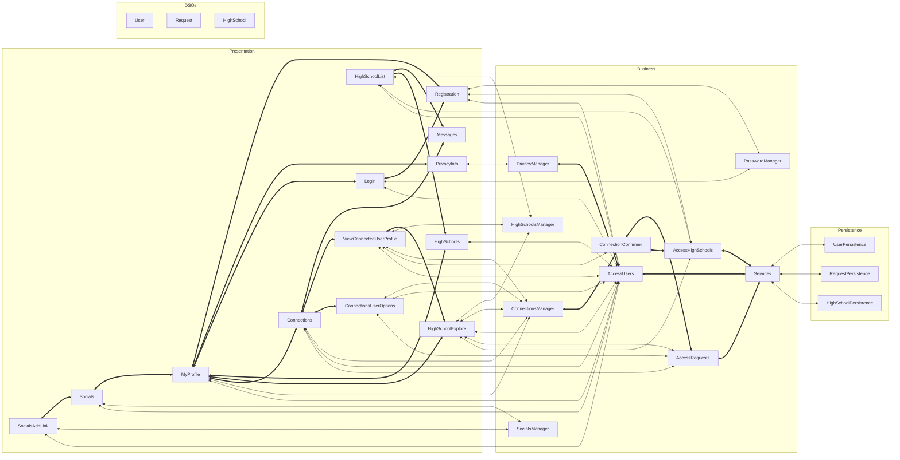

# Architecture

## Architecture Diagram

## [Application Layer](https://code.cs.umanitoba.ca/3350-summer2023/highschool-hub/-/tree/main/app/src/main/java/comp3350/highschoolhub/application)
The application layer provides a bridge between the business layer and the persistence layer.

### [Main](https://code.cs.umanitoba.ca/3350-summer2023/highschool-hub/-/blob/main/app/src/main/java/comp3350/highschoolhub/application/Main.java)
`Main` manages the database path for setting up the database.

### [Services](https://code.cs.umanitoba.ca/3350-summer2023/highschool-hub/-/blob/main/app/src/main/java/comp3350/highschoolhub/application/Services.java)
`Services` handles any persistence objects.

## [Presentation Layer](https://code.cs.umanitoba.ca/3350-summer2023/highschool-hub/-/tree/main/app/src/main/java/comp3350/highschoolhub/presentation)
The presentation layer is responsible for displaying and managing the UI of the app.

### [Connections](https://code.cs.umanitoba.ca/3350-summer2023/highschool-hub/-/blob/main/app/src/main/java/comp3350/highschoolhub/presentation/Connections.java)
`Connections` displays a list of other users that the current user can potentially connect with.

### [ConnectionsUserOptions](https://code.cs.umanitoba.ca/3350-summer2023/highschool-hub/-/blob/main/app/src/main/java/comp3350/highschoolhub/presentation/ConnectionsUserOptions.java)
`ConnectionsUserOptions` provides options for managing a connection request with another user. The current user can send the other user a request or accept an existing request from the other user.

### [HighSchoolExplore](https://code.cs.umanitoba.ca/3350-summer2023/highschool-hub/-/blob/main/app/src/main/java/comp3350/highschoolhub/presentation/HighSchoolExplore.java)
`HighSchoolExplore` lets the current user see and interact with other users associated with a selected high school.

### [HighSchoolList](https://code.cs.umanitoba.ca/3350-summer2023/highschool-hub/-/blob/main/app/src/main/java/comp3350/highschoolhub/presentation/HighSchoolList.java)
`HighSchoolList` presents a list of selectable high schools that a user can add to their account.

### [HighSchools](https://code.cs.umanitoba.ca/3350-summer2023/highschool-hub/-/blob/main/app/src/main/java/comp3350/highschoolhub/presentation/HighSchools.java)
`HighSchools` displays a list of the user's high schools.

### [Login](https://code.cs.umanitoba.ca/3350-summer2023/highschool-hub/-/blob/main/app/src/main/java/comp3350/highschoolhub/presentation/Login.java)
`Login` lets the user log into the app with a username and password.

### [Messages](https://code.cs.umanitoba.ca/3350-summer2023/highschool-hub/-/blob/main/app/src/main/java/comp3350/highschoolhub/presentation/Messages.java)
`Messages` displays error messages in the app.

### [MyProfile](https://code.cs.umanitoba.ca/3350-summer2023/highschool-hub/-/blob/main/app/src/main/java/comp3350/highschoolhub/presentation/MyProfile.java)
`MyProfile` is the profile page for a user and displays a user's provided information.

### [PrivacyInfo](https://code.cs.umanitoba.ca/3350-summer2023/highschool-hub/-/blob/main/app/src/main/java/comp3350/highschoolhub/presentation/PrivacyInfo.java)
`PrivacyInfo` informs the user what info of theirs is private and what is public.

### [Registration](https://code.cs.umanitoba.ca/3350-summer2023/highschool-hub/-/blob/main/app/src/main/java/comp3350/highschoolhub/presentation/Registration.java)
`Registration` lets the user create a new account.

### [Socials](https://code.cs.umanitoba.ca/3350-summer2023/highschool-hub/-/blob/main/app/src/main/java/comp3350/highschoolhub/presentation/Socials.java)
`Socials` displays a list of clickable social media links that a user has added to their account.

### [SocialsAddLink](https://code.cs.umanitoba.ca/3350-summer2023/highschool-hub/-/blob/main/app/src/main/java/comp3350/highschoolhub/presentation/SocialsAddLink.java)
`SocialsAddLink` provides a form that lets the current user add a social media link to their account.

### [ViewConnectedUserProfile](https://code.cs.umanitoba.ca/3350-summer2023/highschool-hub/-/blob/main/app/src/main/java/comp3350/highschoolhub/presentation/ViewConnectedUserProfile.java)
`ViewConnectedUserProfile` provides a page to view another user's profile.

## [Business Layer](https://code.cs.umanitoba.ca/3350-summer2023/highschool-hub/-/tree/main/app/src/main/java/comp3350/highschoolhub/business)
The business layer is responsible for handling the logic behind the app.

### [AccessHighSchools](https://code.cs.umanitoba.ca/3350-summer2023/highschool-hub/-/blob/main/app/src/main/java/comp3350/highschoolhub/business/AccessHighSchools.java)
`AccessHighSchools` provides access to `HighSchoolPersistence`.

### [AccessRequests](https://code.cs.umanitoba.ca/3350-summer2023/highschool-hub/-/blob/main/app/src/main/java/comp3350/highschoolhub/business/AccessRequests.java)
`AccessRequests` provides access to `RequestPersistence`.

### [AccessUsers](https://code.cs.umanitoba.ca/3350-summer2023/highschool-hub/-/blob/main/app/src/main/java/comp3350/highschoolhub/business/AccessUsers.java)
`AccessUsers` provides access to `UserPersistence`.

### [ConnectionConfirmer](https://code.cs.umanitoba.ca/3350-summer2023/highschool-hub/-/blob/main/app/src/main/java/comp3350/highschoolhub/business/ConnectionConfirmer.java)
`ConnectionConfirmer` handles logic for `ViewConnectedUserProfile`.

### [ConnectionsManager](https://code.cs.umanitoba.ca/3350-summer2023/highschool-hub/-/blob/main/app/src/main/java/comp3350/highschoolhub/business/ConnectionsManager.java)
`ConnectionsManager` handles logic for the connections part of the UI.

### [CopyDatabase](https://code.cs.umanitoba.ca/3350-summer2023/highschool-hub/-/blob/main/app/src/main/java/comp3350/highschoolhub/business/CopyDatabase.java)
`CopyDatabase` copies the database to the device.

### [HighSchoolsManager](https://code.cs.umanitoba.ca/3350-summer2023/highschool-hub/-/blob/main/app/src/main/java/comp3350/highschoolhub/business/HighSchoolsManager.java)
`HighSchoolsManager` handles logic for the high schools part of the UI.

### [PasswordManager](https://code.cs.umanitoba.ca/3350-summer2023/highschool-hub/-/blob/main/app/src/main/java/comp3350/highschoolhub/business/PasswordManager.java)
`PasswordManager` handles logic for user passwords and login.

### [PrivacyManager](https://code.cs.umanitoba.ca/3350-summer2023/highschool-hub/-/blob/main/app/src/main/java/comp3350/highschoolhub/business/PrivacyManager.java)
`PrivacyManager` handles logic for the privacy info part of the UI.

### [SocialsManager](https://code.cs.umanitoba.ca/3350-summer2023/highschool-hub/-/blob/main/app/src/main/java/comp3350/highschoolhub/business/SocialsManager.java)
`SocialsManager` handles logic for the social media part of the UI.

### [InvalidLinkException](https://code.cs.umanitoba.ca/3350-summer2023/highschool-hub/-/blob/main/app/src/main/java/comp3350/highschoolhub/business/InvalidLinkException.java)
`InvalidLinkException` is thrown for invalid link formats for social media links.

### [InvalidPlatformException](https://code.cs.umanitoba.ca/3350-summer2023/highschool-hub/-/blob/main/app/src/main/java/comp3350/highschoolhub/business/InvalidPlatformException.java)
`InvalidPlatformException` is thrown for invalid platform formats for social media links.

## [Persistence Layer](https://code.cs.umanitoba.ca/3350-summer2023/highschool-hub/-/tree/main/app/src/main/java/comp3350/highschoolhub/persistence)
The persistence layer is responsible for storing data for the app.

### [HighSchoolPersistence](https://code.cs.umanitoba.ca/3350-summer2023/highschool-hub/-/blob/main/app/src/main/java/comp3350/highschoolhub/persistence/HighSchoolPersistence.java)
`HighSchoolPersistence` is the interface for `HighSchool` objects in the database.

### [RequestPersistence](https://code.cs.umanitoba.ca/3350-summer2023/highschool-hub/-/blob/main/app/src/main/java/comp3350/highschoolhub/persistence/RequestPersistence.java)
`RequestPersistence` is the interface for `Request` objects in the database.

### [UserPersistence](https://code.cs.umanitoba.ca/3350-summer2023/highschool-hub/-/blob/main/app/src/main/java/comp3350/highschoolhub/persistence/UserPersistence.java)
`UserPersistence` is the interface for `User` objects in the database.

### [Stubs](https://code.cs.umanitoba.ca/3350-summer2023/highschool-hub/-/tree/main/app/src/main/java/comp3350/highschoolhub/persistence/stubs)

#### [HighSchoolPersistenceStub](https://code.cs.umanitoba.ca/3350-summer2023/highschool-hub/-/blob/main/app/src/main/java/comp3350/highschoolhub/persistence/stubs/HighSchoolPersistenceStub.java)
`HighSchoolPersistenceStub` is the implementation of a stub database for `HighSchool` objects.

#### [RequestPersistenceStub](https://code.cs.umanitoba.ca/3350-summer2023/highschool-hub/-/blob/main/app/src/main/java/comp3350/highschoolhub/persistence/stubs/RequestPersistenceStub.java)
`RequestPersistenceStub` is the implementation of a stub database for `Request` objects.

#### [UserPersistenceStub](https://code.cs.umanitoba.ca/3350-summer2023/highschool-hub/-/blob/main/app/src/main/java/comp3350/highschoolhub/persistence/stubs/UserPersistenceStub.java)
`UserPersistenceStub` is the implementation of a stub database for `User` objects.

### [HSQLDB](https://code.cs.umanitoba.ca/3350-summer2023/highschool-hub/-/tree/main/app/src/main/java/comp3350/highschoolhub/persistence/hsqldb)

#### [HighSchoolPersistenceHSQLDB](https://code.cs.umanitoba.ca/3350-summer2023/highschool-hub/-/blob/main/app/src/main/java/comp3350/highschoolhub/persistence/hsqldb/HighSchoolPersistenceHSQLDB.java)
`HighSchoolPersistenceHSQLDB` is the implementation of an HSQLDB database for `HighSchool` objects.

#### [RequestPersistenceHSQLDB](https://code.cs.umanitoba.ca/3350-summer2023/highschool-hub/-/blob/main/app/src/main/java/comp3350/highschoolhub/persistence/hsqldb/RequestPersistenceHSQLDB.java)
`RequestPersistenceHSQLDB` is the implementation of an HSQLDB database for `Request` objects.

#### [UserPersistenceHSQLDB](https://code.cs.umanitoba.ca/3350-summer2023/highschool-hub/-/blob/main/app/src/main/java/comp3350/highschoolhub/persistence/hsqldb/UserPersistenceHSQLDB.java)
`UserPersistenceHSQLDB` is the implementation of an HSQLDB database for `User` objects.

#### [PersistenceException](https://code.cs.umanitoba.ca/3350-summer2023/highschool-hub/-/blob/main/app/src/main/java/comp3350/highschoolhub/persistence/hsqldb/PersistenceException.java)
`PersistenceException` is used for catching persistence exceptions.

## [Domain Specific Objects](https://code.cs.umanitoba.ca/3350-summer2023/highschool-hub/-/tree/main/app/src/main/java/comp3350/highschoolhub/objects)
Domain Specific Objects are passed between all layers of the app.

### [HighSchool](https://code.cs.umanitoba.ca/3350-summer2023/highschool-hub/-/blob/main/app/src/main/java/comp3350/highschoolhub/objects/HighSchool.java)
A `HighSchool` object stores information about a high school.

### [Request](https://code.cs.umanitoba.ca/3350-summer2023/highschool-hub/-/blob/main/app/src/main/java/comp3350/highschoolhub/objects/Request.java)
A `Request` object stores the details of a request sent between two users.

### [User](https://code.cs.umanitoba.ca/3350-summer2023/highschool-hub/-/blob/main/app/src/main/java/comp3350/highschoolhub/objects/User.java)
A `User` object stores information about a user of the app.
