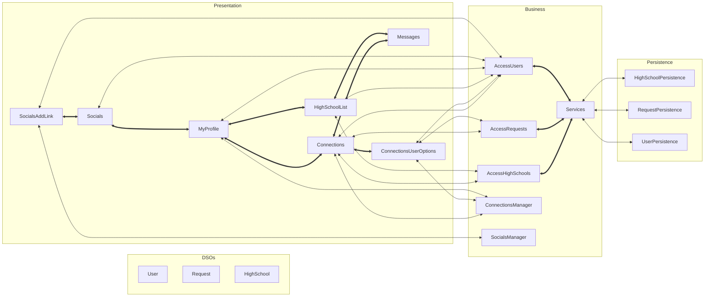

# Architecture

## Architecture Diagram

## [Presentation Layer](https://code.cs.umanitoba.ca/3350-summer2023/highschool-hub/-/tree/main/app/src/main/java/comp3350/highschoolhub/presentation)
The presentation layer is responsible for displaying and managing the UI of the app.

### [Connections](https://code.cs.umanitoba.ca/3350-summer2023/highschool-hub/-/blob/main/app/src/main/java/comp3350/highschoolhub/presentation/Connections.java)
`Connections` displays a list of other users that the current user can potentially connect with.

### [ConnectionsUserOptions](https://code.cs.umanitoba.ca/3350-summer2023/highschool-hub/-/blob/main/app/src/main/java/comp3350/highschoolhub/presentation/ConnectionsUserOptions.java)
`ConnectionsUserOptions` provides options for managing a connection request with another user. The current user can send the other user a request or accept an existing request from the other user.

### [MyProfile](https://code.cs.umanitoba.ca/3350-summer2023/highschool-hub/-/blob/main/app/src/main/java/comp3350/highschoolhub/presentation/MyProfile.java)
`MyProfile` is the profile page for a user and displays a user's provided information.

### [Socials](https://code.cs.umanitoba.ca/3350-summer2023/highschool-hub/-/blob/main/app/src/main/java/comp3350/highschoolhub/presentation/Socials.java)
`Socials` displays a list of clickable social media links that a user has added to their account.

### [SocialsAddLink](https://code.cs.umanitoba.ca/3350-summer2023/highschool-hub/-/blob/main/app/src/main/java/comp3350/highschoolhub/presentation/SocialsAddLink.java)
`SocialsAddLink` provides a form that lets the current user add a social media link to their account.

## [Business Layer](https://code.cs.umanitoba.ca/3350-summer2023/highschool-hub/-/tree/main/app/src/main/java/comp3350/highschoolhub/business)
The business layer is responsible for handling the logic behind the app.

### [AccessHighSchools](https://code.cs.umanitoba.ca/3350-summer2023/highschool-hub/-/blob/main/app/src/main/java/comp3350/highschoolhub/business/AccessHighSchools.java)
`AccessHighSchools` provides access to `HighSchoolPersistence`.

### [AccessRequests](https://code.cs.umanitoba.ca/3350-summer2023/highschool-hub/-/blob/main/app/src/main/java/comp3350/highschoolhub/business/AccessRequests.java)
`AccessRequests` provides access to `RequestPersistence`.

### [AccessUsers](https://code.cs.umanitoba.ca/3350-summer2023/highschool-hub/-/blob/main/app/src/main/java/comp3350/highschoolhub/business/AccessUsers.java)
`AccessUsers` provides access to `UserPersistence`.

### [ConnectionsManager](https://code.cs.umanitoba.ca/3350-summer2023/highschool-hub/-/blob/main/app/src/main/java/comp3350/highschoolhub/business/ConnectionsManager.java)
`ConnectionsManager` handles logic for the connections part of the UI.

### [HighSchoolList](https://code.cs.umanitoba.ca/3350-summer2023/highschool-hub/-/blob/main/app/src/main/java/comp3350/highschoolhub/presentation/HighSchoolList.java)
`HighSchoolList` presents a list of selectable high schools that a user can add to their account.

### [Messages](https://code.cs.umanitoba.ca/3350-summer2023/highschool-hub/-/blob/main/app/src/main/java/comp3350/highschoolhub/presentation/Messages.java)
`Messages` displays error messages in the app.

### [SocialsManager](https://code.cs.umanitoba.ca/3350-summer2023/highschool-hub/-/blob/main/app/src/main/java/comp3350/highschoolhub/business/SocialsManager.java)
`SocialsManager` handles logic for the social media part of the UI.

### [Services](https://code.cs.umanitoba.ca/3350-summer2023/highschool-hub/-/blob/main/app/src/main/java/comp3350/highschoolhub/application/Services.java)
`Services` handles any persistence objects.

## [Persistence Layer](https://code.cs.umanitoba.ca/3350-summer2023/highschool-hub/-/tree/main/app/src/main/java/comp3350/highschoolhub/persistence)
The persistence layer is responsible for storing data for the app.

### [HighSchoolPersistence](https://code.cs.umanitoba.ca/3350-summer2023/highschool-hub/-/blob/main/app/src/main/java/comp3350/highschoolhub/persistence/HighSchoolPersistence.java)
`HighSchoolPersistence` is the interface for `HighSchool` objects in the database.

### [RequestPersistence](https://code.cs.umanitoba.ca/3350-summer2023/highschool-hub/-/blob/main/app/src/main/java/comp3350/highschoolhub/persistence/RequestPersistence.java)
`RequestPersistence` is the interface for `Request` objects in the database.

### [UserPersistence](https://code.cs.umanitoba.ca/3350-summer2023/highschool-hub/-/blob/main/app/src/main/java/comp3350/highschoolhub/persistence/UserPersistence.java)
`UserPersistence` is the interface for `User` objects in the database.

### [Stubs](https://code.cs.umanitoba.ca/3350-summer2023/highschool-hub/-/tree/main/app/src/main/java/comp3350/highschoolhub/persistence/stubs)

#### [HighSchoolPersistenceStub](https://code.cs.umanitoba.ca/3350-summer2023/highschool-hub/-/blob/main/app/src/main/java/comp3350/highschoolhub/persistence/stubs/HighSchoolPersistenceStub.java)
`HighSchoolPersistenceStub` is the implementation of a stub database for `HighSchool` objects.

#### [RequestPersistenceStub](https://code.cs.umanitoba.ca/3350-summer2023/highschool-hub/-/blob/main/app/src/main/java/comp3350/highschoolhub/persistence/stubs/RequestPersistenceStub.java)
`RequestPersistenceStub` is the implementation of a stub database for `Request` objects.

#### [UserPersistenceStub](https://code.cs.umanitoba.ca/3350-summer2023/highschool-hub/-/blob/main/app/src/main/java/comp3350/highschoolhub/persistence/stubs/UserPersistenceStub.java)
`UserPersistenceStub` is the implementation of a stub database for `User` objects.

## [Domain Specific Objects](https://code.cs.umanitoba.ca/3350-summer2023/highschool-hub/-/tree/main/app/src/main/java/comp3350/highschoolhub/objects)
Domain Specific Objects are passed between all layers of the app.

### [HighSchool](https://code.cs.umanitoba.ca/3350-summer2023/highschool-hub/-/blob/main/app/src/main/java/comp3350/highschoolhub/objects/HighSchool.java)
A `HighSchool` object stores information about a high school.

### [Request](https://code.cs.umanitoba.ca/3350-summer2023/highschool-hub/-/blob/main/app/src/main/java/comp3350/highschoolhub/objects/Request.java)
A `Request` object stores the details of a request sent between two users.

### [User](https://code.cs.umanitoba.ca/3350-summer2023/highschool-hub/-/blob/main/app/src/main/java/comp3350/highschoolhub/objects/User.java)
A `User` object stores information of a user of the app.
