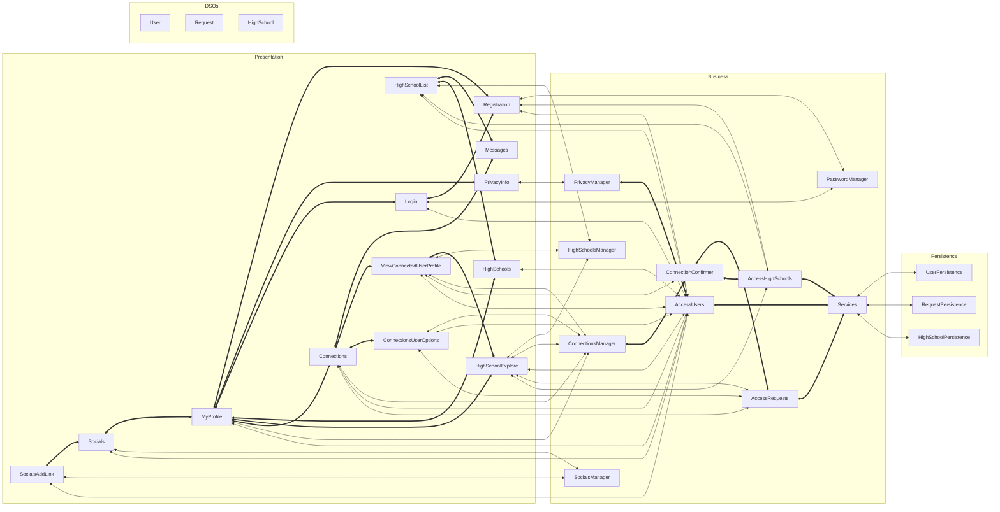

```mermaid
%% Note: GitLab no longer automatically renders this diagram; it displays a
%% performance issue warning, and you must now agree to display the diagram before
%% it will render. A backup picture can be found at
%% https://code.cs.umanitoba.ca/3350-summer2023/highschool-hub/-/blob/main/docs/mermaid-diagram-backup.png.

  flowchart LR
    %% Links between nodes of different subgraphs
    Connections <--> AccessRequests & AccessUsers & ConnectionsManager
    ConnectionsUserOptions <-----> AccessRequests & AccessUsers
    ConnectionsUserOptions <---> ConnectionsManager
    HighSchoolExplore <--> AccessHighSchools & AccessRequests & AccessUsers
    HighSchoolExplore <--> ConnectionsManager & HighSchoolsManager
    HighSchoolList <--> AccessUsers & AccessHighSchools & HighSchoolsManager
    HighSchools <----> AccessUsers
    Login <--> AccessUsers & PasswordManager
    MyProfile <--> AccessUsers & ConnectionsManager
    PrivacyInfo <--> PrivacyManager
    Registration <---> AccessUsers & AccessHighSchools & PasswordManager
    Socials <--> AccessUsers & SocialsManager
    SocialsAddLink <--> AccessUsers & SocialsManager
    ViewConnectedUserProfile <--> AccessUsers & ConnectionConfirmer & ConnectionsManager & HighSchoolsManager

    Services <--> HighSchoolPersistence & RequestPersistence & UserPersistence

    subgraph Presentation
    Connections <==> ConnectionsUserOptions
    Connections <==> ViewConnectedUserProfile
    HighSchoolList <==> HighSchools
    Login <==> Registration
    MyProfile <==> Connections
    MyProfile <==> HighSchoolExplore
    MyProfile <==> HighSchools
    MyProfile <==> Login
    MyProfile <==> PrivacyInfo
    MyProfile <==> Registration
    Socials <==> MyProfile
    SocialsAddLink <==> Socials
    Connections & HighSchoolList <==> Messages
    ViewConnectedUserProfile <==> HighSchoolExplore
    end

    subgraph Business
    AccessHighSchools & AccessRequests & AccessUsers <==> Services
    ConnectionConfirmer <==> AccessHighSchools & AccessRequests
    ConnectionsManager <===> ConnectionConfirmer
    HighSchoolsManager
    PasswordManager
    PrivacyManager <==> AccessUsers
    SocialsManager
    end

    subgraph Persistence
    HighSchoolPersistence
    RequestPersistence
    UserPersistence
    end

    subgraph DSOs
    User
    Request
    HighSchool
    end

    %% Invisible link(s) to keep graphs together
    DSOs ~~~ Presentation
    AccessHighSchools ~~~ PasswordManager

```
