## What was not successful?
Two major issues occured that were observed in Iteration 2:
1. Time Estimates: Time estimates were too short for a lot of tasks. This caused some tasks not to be completed
on time. Furthermore, some of the tasks that did get completed came in later than expected which left little time
to test the app very extensively. This also caused the UI to get little attention which made it not the best feature
of the app.
2. Syncing Files: Due to not pulling from "main" before working on the project, sometimes the files were out of sync.
This caused merge conflicts at critical times which took a lot of work to resolve. Some work also had to be redone as
a result of this.

## Ways of improvement
Two major ways of improvement were discussed:
1. Deeper Task Analysis: Analyse and discuss tasks more before creating them. Bigger tasks need to be broken down so
that the time estimates are better. Unfamiliar tasks should be addressed first since they are most likely to have the
wrong estimate. If a member has not worked with UI before and are assigned a UI task, they should adjust the estimate
to reflect as such and perhaps start these tasks earlier. Perhaps a designated meeting for task length evaluation
would benefit the team.
2. Apply FI/RI: Applying Forward Integration/Reverse Itegration would greatly help with out of sync issues that came up
during Iteration 2. Pulling from "main" before doing any work and doing it again before pushing changes would prevent
this issue in most cases. In fact, this method was frequently used in Iteration 3 and almost no such problems persisted. 

## The chart
The X-axis shows the number of days (starting from day 001). 

```mermaid
gantt
    title Project Velocity Chart
    dateFormat  X
    axisFormat %d
    section IT1
        Estimate IT1    :1, 7d
        Actual IT1      :1, 14d 
    section IT2
        Estimate IT2    :1, 5d
        Actual IT2      :1, 7d
```

